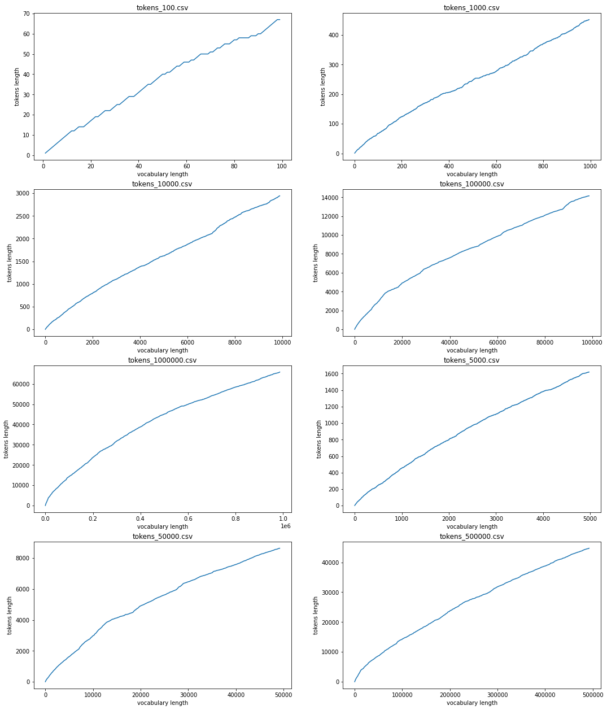

# Instrucciones para instalar

## Crear ambiente virtual

```bash
python3 -m venv venv

# windows
./venv/Scripts/activate

# instalar librerias
pip install -r requirements.txt
``` 

## Ejecutar crawler
```bash
scrapy crawl pagination -a tokens={tokens} -O data/tokens_{tokens}.csv
```
Donde {tokens} corresponde a la cantidad de tokens que se desea que el crawler obtenga. Por ejemplo:
```bash
scrapy crawl pagination -a tokens=100000 -O tokens_100000.csv
```

## Ejecutar jupyter
```bash
jupyter notebook code/main.ipynb
```

# Descripción
Se hizo un scrapper de páginas de wikipedia. Se partió de un artículo base (en este caso: https://es.wikipedia.org/wiki/Tecnolog%C3%ADa, pero el crawler funciona partiendo desde cualquier artículo) y el scrapper obtiene todo el texto del artículo, hace una limpieza básica, obtiene los tokens, los acumula y si no ha llegado a la cantidad deseada busca todos los hipervínculos de wikipedia dentro del artículo y los agrega para continuar scrappeando.
<br/>
Una vez obtenido el texto en formato csv, se procede a ejectuar el archivo de jupyter, en el cual se leen todos los archivos `.csv` dentro de la carpeta `/data` y se grafican tomando en cuenta el crecimiento del vocabulario y los tokens.

# Resultado del crawler
Se utilizó un formato CSV para guardar el resultado. Se guarda en el archivo *tokens_{tokens}.csv*. El CSV contiene únicamente una columna **text** con el texto de los artículos. Cada artículo se dejó en una única línea y la primara oración de cada línea corresponde al título del mismo

# Resultado del jupyter
El script de jupyter lee todos los archivos `.csv` en la carpeta `/data` y realiza la limpieza de las palabras de cada archivo. Para la limpieza se toman todas las palabras en minúsculas y se remueven caracteres como puntos y comas. Una vez realizado esto, se guarda un vector con la cantidad de palabras del vocabulario y la cantidad distinta de tokens para ser graficado.
Palabras hasta el momento | Tokens
--|--
...|...

Se toma cada vector y se grafica como _subplot_ para poder comparar la tendencia de la cantidad de palabras distintas. 



# Contribuciones
Grupo 3 en canvas
- Kevin García: 
- Martín Guzmán: 
